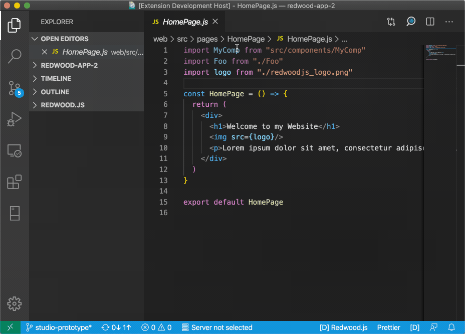
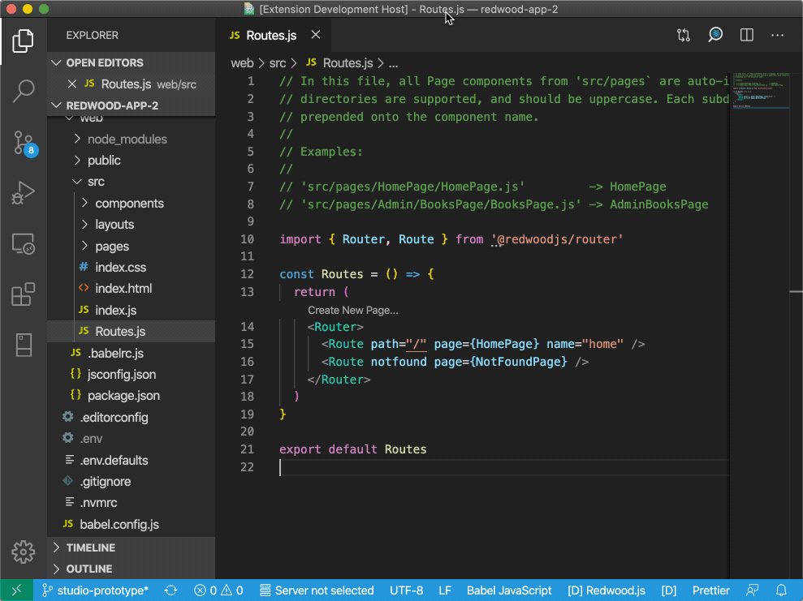
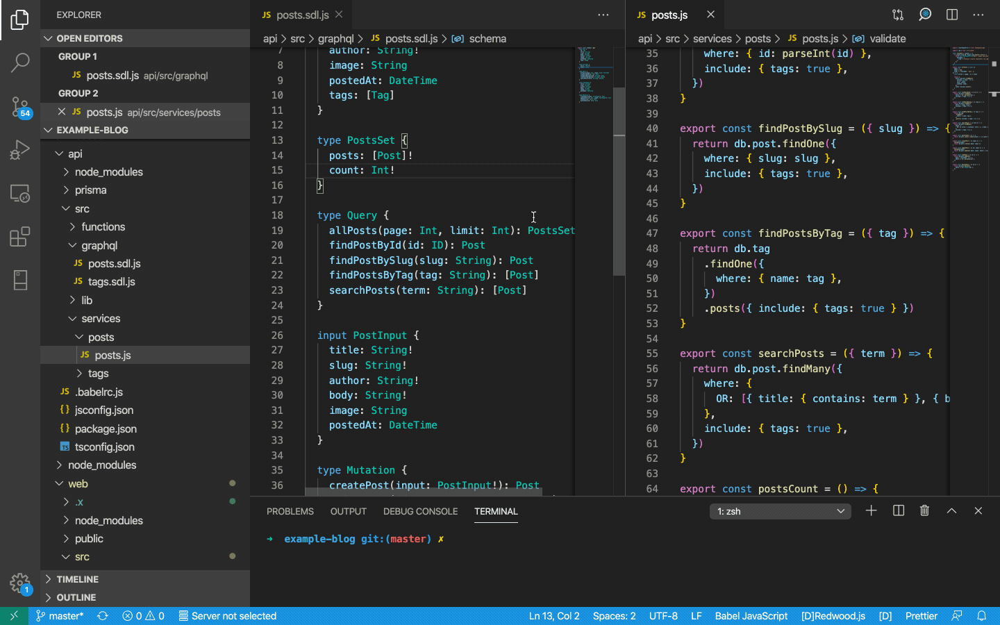

- [Redwood](https://redwoodjs.com/) is a full-stack Jamstack web framework.
- This extension provides support for Redwood in VSCode

Note: **Works best with Redwood JS >=0.19.2**

- Issues: https://github.com/redwoodjs/redwood/issues

# Features

## Redwood Outline / Project Explorer

Explore your project with a Redwood-aware outline that provides convenient access to routes, pages, cells, services, generators, and more!

## Commands > Redwood: Generate...

- Redwood provides Ruby-Style generators for every aspect of the framework via the `redwood generate <type> <name>` command (or `rw g`)
- The Redwood IDE brings generators closer to the VSCode experience by augmenting them in a few ways:
  - Exposes generators via VSCode commands, code lenses, and other native affordances
  - Makes sure generated code plays nicely with open/unsaved editors and undo/redo
  - Enriches the generation logic with extra validations and information. For example, by listing the available Models in the schema.prisma file, or detecting duplicate routes, potential overwrites, etc.

## Diagnostics

Find structural errors during development

- Redwood relies extensively on conventions to eliminate boilerplate and APIs
- The VSCode extension understands and enforces some of these rules across layers and languages

* For example: Linking GraphQL SDLs + JS Service Implementations

## More Commands

- Redwood: Show Project Outline
  - Show Outline
- Redwood: Generate...
  - `$ redwood generate...`
- Redwood: Interactive CLI...
  - `$ redwood ...`
